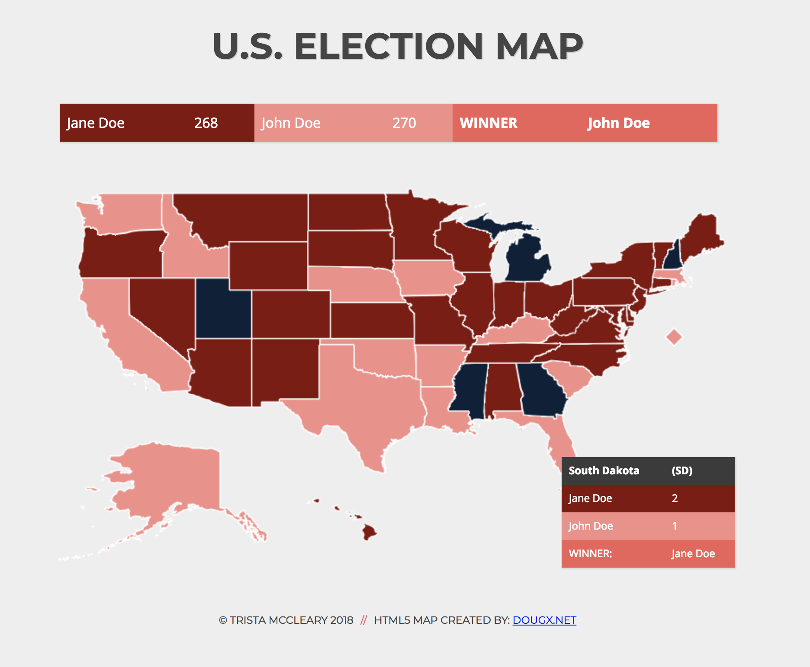
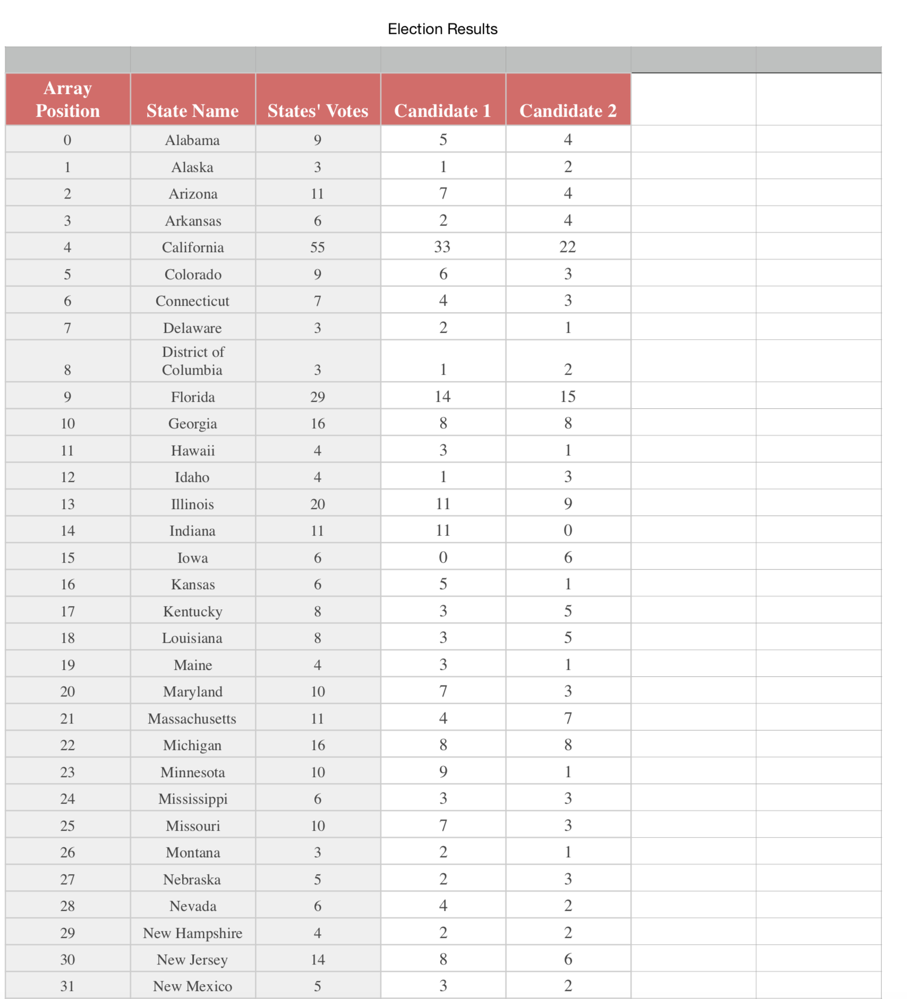
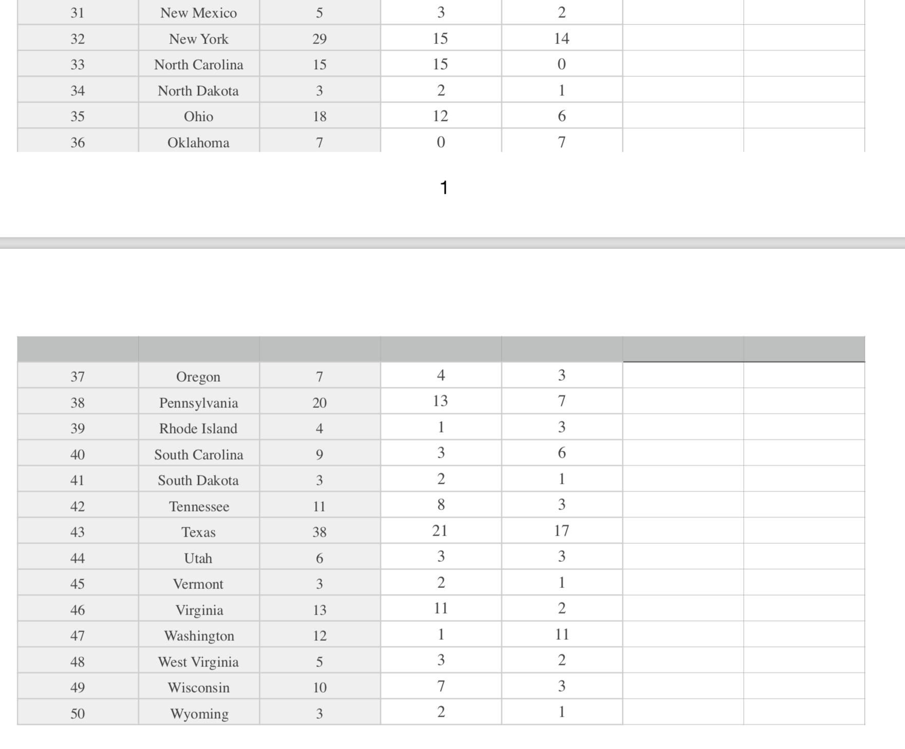

# Election Map

Single page website that displays the winners of the election at the top of the map. Mouse over each state to change the color and see who won that state. (HTML/CSS/JavaScript)
** code reference to third-party file map.js

### Context
* There are two fictitious candidates, each running for President.

* Voting model is based on an electoral college alternative: each state has a set number of votes that they can cast for one of the candidates.

* The number of votes from each state can be used to show who won which state - both in the table on the bottom right and when you mouse over a state.

### Click here for [Demo](https://mccleary.github.io/election-map)

### Election Map Screenshot

### State Results Spreadsheet

